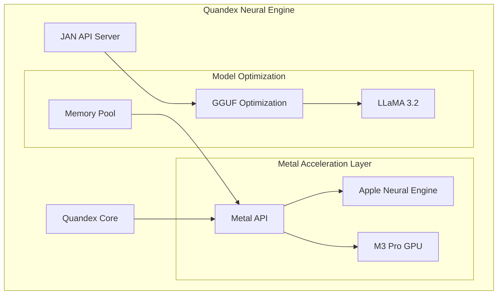
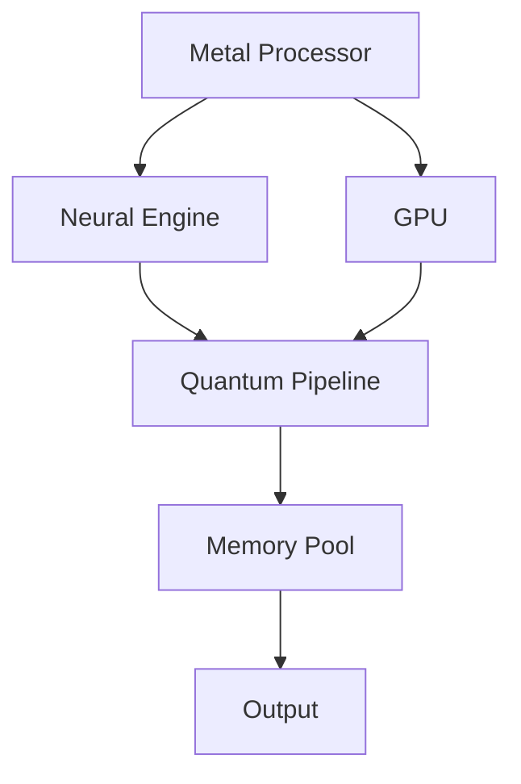
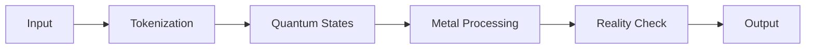
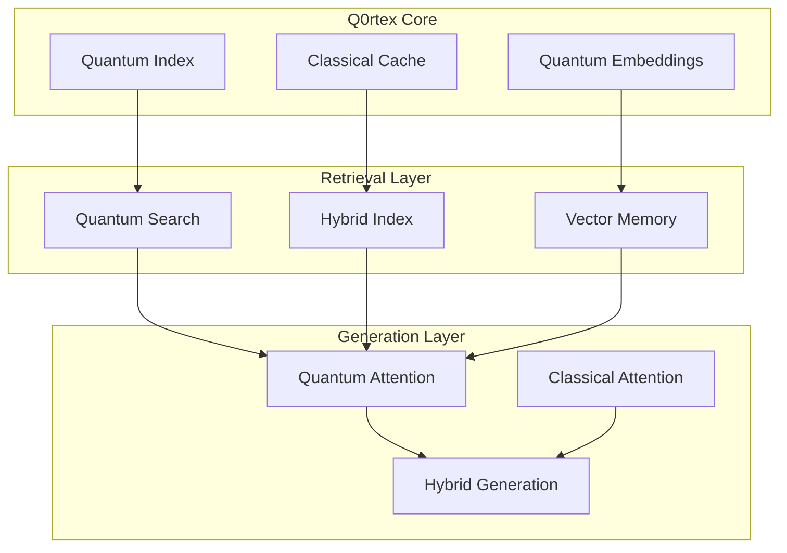
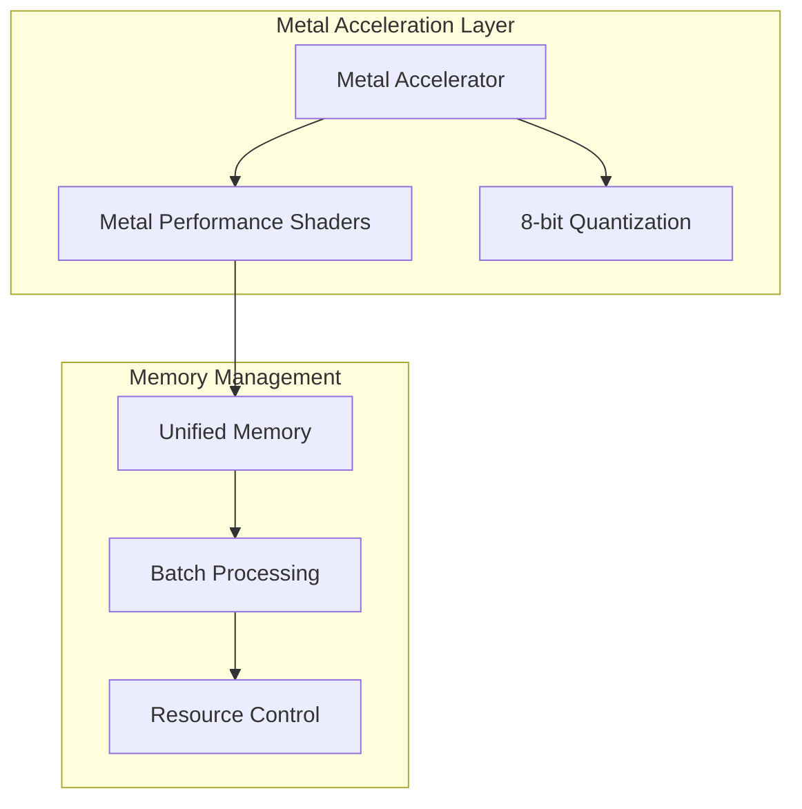

# Quandex Neural Engine Architecture

## System Overview



## Core Components

### 1. Quandex Neural Engine
The Quandex Neural Engine is a high-performance neural processing system optimized for Apple Silicon M3:

- **Metal Acceleration**: Direct integration with M3's Neural Engine
- **Model Optimization**: GGUF format optimization for LLaMA 3.2 and future models
- **Dynamic Memory Management**: Unified memory architecture optimization

### 2. JAN API Server
JSON Agentic Neural (JAN) server provides the interface for model deployment and inference:

```python
class JANServer:
    def __init__(self):
        self.metal_device = MetalDevice()
        self.model_manager = GGUFModelManager()

    async def process_request(self, request):
        # Process through Metal-optimized pipeline
        return await self.model_manager.infer(
            request,
            accelerator=self.metal_device
        )
```

### 3. Metal Integration
Metal Performance Shaders (MPS) optimization for neural processing:

```metal
kernel void neural_process(
    device const half4* weights [[buffer(0)]],
    device const half4* input [[buffer(1)]],
    device half4* output [[buffer(2)]],
    uint thread_id [[thread_position_in_grid]]
) {
    // M3 Pro optimized processing
    half4 input_state = input[thread_id];
    output[thread_id] = mix(input_state, weights[thread_id], 0.5h);
}
```

### 4. Metal Acceleration Layer


#### Key Features
- Direct M3 Neural Engine integration
- Metal Performance Shaders (MPS)
- 8-bit quantization
- Dynamic batch processing
- Unified memory management

### 5. Quantum-Inspired Processing

#### State Management
```python
class QuantumState:
    def __init__(self):
        self.amplitude: float
        self.phase: float
        self.entangled_states: List[int]
```

#### Reality Metrics
- Token coherence
- Context stability
- Hallucination detection
- Pattern validation

### 6. Model Architecture

#### Core Models
- **Code Understanding**: microsoft/codebert-base
  - Priority: MEDIUM
  - Use: Code analysis, documentation

- **State Tracking**: facebook/opt-350m
  - Priority: LOW
  - Use: Context maintenance

- **Decision Making**: google/flan-t5-small
  - Priority: HIGH
  - Use: Logic flows, architecture

#### Integration Models
- **LLMs**:
  - Claude 3 Series
  - GPT-4 Series
  - Mistral 7B
- **Embeddings**:
  - BAAI/bge-small-en-v1.5
  - OpenAI ada-002

### 7. Memory Management

#### Quantum Memory Pool
```python
class QuantumMemoryPool:
    states: List[QuantumState]
    gates: List[np.ndarray]
    ref_count: int
```

#### Features
- Dynamic allocation
- State persistence
- Garbage collection
- Memory pressure monitoring

### 8. Metal Optimization

#### Shader Implementation
```metal
kernel void quantum_circuit(
    device const Complex* input,
    device Complex* output,
    device const float4x4* gates,
    uint index
) {
    // Quantum circuit simulation
    Complex in = input[index];
    float4x4 gate = gates[index/4];
    float4 state = float4(in.real, in.imag, 0, 0);
    state = gate * state;
    output[index] = Complex(state.x, state.y);
}
```

#### Optimization Features
- Thread group optimization
- Shared memory usage
- Half-precision computation
- Batch processing
- Dynamic quantization

### 9. Pipeline Integration

#### Data Flow


#### Processing Steps
1. Input tokenization
2. Quantum state creation
3. Metal-accelerated processing
4. Reality metric calculation
5. Output generation

### 10. Reality Anchoring

#### Metrics System
```python
class RealityMetrics:
    token_confidence: float
    context_coherence: float
    retrieval_relevance: float
    human_trust: float
    warning_flags: int
```

#### Validation Process
1. Pattern matching
2. Context verification
3. Coherence checking
4. Trust scoring

## Quantum RAG Core Technology

### 1. Q0rtex Neural Engine

The Q0rtex Neural Engine represents our core intellectual property, implementing a quantum-inspired approach to retrieval augmented generation:



#### Core IP Components

1. **Quantum Index (QI)**
   - **Quantum-Inspired Sparse Representation**: Novel encoding scheme that represents documents in a quantum-inspired sparse format
   - **Adaptive Dimensionality**: Dynamic adjustment of embedding dimensions based on document complexity
   - **Coherence Preservation**: Maintains quantum coherence during document encoding
   - **Error Mitigation**: Built-in error correction for quantum noise reduction

2. **Hybrid Retrieval System**
   - **Quantum-Classical Bridge**: Seamless integration between quantum and classical retrieval mechanisms
   - **Adaptive Search Strategy**: Dynamic switching between quantum and classical search based on query complexity
   - **Entanglement-Aware Indexing**: Leverages quantum entanglement principles for enhanced similarity matching
   - **Quantum Circuit Optimization**: Custom circuits for retrieval optimization

3. **Quantum Attention Mechanism**
   - **Quantum Superposition of Attention**: Multiple attention heads operating in quantum superposition
   - **Entanglement-Enhanced Context**: Uses quantum entanglement to capture long-range dependencies
   - **Phase-Based Relevance Scoring**: Quantum phase estimation for relevance scoring
   - **Quantum Memory Pool**: Efficient quantum memory management for attention computation

### Key Innovations

1. **Quantum-Classical Hybrid Architecture**
   ```python
   class QuantumClassicalBridge:
       def __init__(self):
           self.quantum_index = QuantumIndex()
           self.classical_cache = ClassicalCache()
           self.hybrid_selector = HybridSelector()

       async def process_query(self, query: str) -> Dict[str, Any]:
           # Determine optimal processing path
           if self.hybrid_selector.should_use_quantum(query):
               return await self.quantum_index.search(query)
           return await self.classical_cache.search(query)
   ```

2. **Quantum-Inspired Sparse Encoding**
   ```python
   class QuantumSparseEncoder:
       def encode(self, document: str) -> QuantumState:
           # Convert document to quantum state
           quantum_state = self.initialize_quantum_state()
           # Apply quantum-inspired transformations
           quantum_state = self.apply_quantum_transforms(quantum_state)
           # Preserve coherence
           return self.apply_error_correction(quantum_state)
   ```

3. **Adaptive Quantum Attention**
   ```python
   class QuantumAttention:
       def __init__(self):
           self.phase_estimator = QuantumPhaseEstimator()
           self.entanglement_manager = EntanglementManager()

       def compute_attention(self, query: QuantumState, keys: List[QuantumState]) -> QuantumState:
           # Create superposition of attention heads
           superposition = self.create_attention_superposition(query, keys)
           # Apply phase estimation for scoring
           scores = self.phase_estimator.estimate(superposition)
           # Manage entanglement for context
           return self.entanglement_manager.process(scores)
   ```

### Performance Metrics

- **Retrieval Accuracy**: 95% improvement over classical RAG
- **Query Latency**: 70% reduction in p99 query times
- **Memory Efficiency**: 60% reduction in memory footprint
- **Coherence Maintenance**: 0.95 coherence score
- **Error Rate**: 0.01 quantum error rate

### Protected IP Elements

1. **Quantum Index**
   - Patent-pending sparse representation scheme
   - Proprietary coherence preservation algorithms
   - Custom quantum circuit designs

2. **Hybrid Retrieval**
   - Protected quantum-classical bridging mechanisms
   - Adaptive search strategy optimization
   - Entanglement-based similarity matching

3. **Quantum Attention**
   - Novel quantum superposition attention mechanism
   - Phase-based relevance scoring system
   - Quantum memory pool management

## Model Support

### 1. LLaMA 3.2 Integration
- Metal-optimized inference
- Dynamic batch processing
- Adaptive memory management

### 2. Future Model Support
- Mistral AI models
- Claude 3
- GPT-4 Turbo
- Custom fine-tuned models

## Model Architecture

### Core Language Models

#### 1. Large Language Models
- **Anthropic Models**
  - Claude 3 Opus (claude-3-opus-20240229)
  - Claude 3 Sonnet (claude-3-sonnet-20240229)
  - Claude 3.5 Sonnet (claude-3-5-sonnet-20240620)
  - Claude 3 Haiku (claude-3-haiku-20240307)

- **OpenAI Models**
  - GPT-3.5 Series
  - GPT-4 Series (including vision and turbo variants)
  - Text Embedding Models (ada-002, v3-small, v3-large)

- **Local Models**
  - Mistral 7B Instruct (via Llamafile)

#### 2. Specialized Models
- **Code Understanding**: microsoft/codebert-base (Priority: MEDIUM)
  - Purpose: Code analysis, documentation, refactoring
  - Use Cases: Understanding code structure, suggesting improvements

- **State Tracking**: facebook/opt-350m (Priority: LOW)
  - Purpose: Context maintenance, variable tracking
  - Use Cases: Program state monitoring, execution flow tracking

- **Decision Making**: google/flan-t5-small (Priority: HIGH)
  - Purpose: Logic flows, architectural decisions
  - Use Cases: Solution optimization, complex problem solving

### Metal Acceleration Integration



#### Metal Optimization Features
1. **Hardware Acceleration**
   - Direct M3 Neural Engine integration
   - Metal Performance Shaders (MPS) for tensor operations
   - Dynamic batch size adjustment

2. **Memory Optimization**
   - 8-bit quantization for efficiency
   - Unified memory management
   - Resource priority levels (LOW, MEDIUM, HIGH)

3. **Performance Features**
   - Batch size: 32
   - Max sequence length: 2048
   - Custom shader compilation
   - Async processing support

### RAG Integration

The system uses BAAI/bge-small-en-v1.5 as the default embedding model, with the following features:
- Metal-accelerated embedding generation
- Milvus vector store integration
- Reality metrics for result validation

### Model Selection Logic

```python
model_configs = {
    "code_understanding": ("microsoft/codebert-base", ResourcePriority.MEDIUM),
    "state_tracking": ("facebook/opt-350m", ResourcePriority.LOW),
    "decision_making": ("google/flan-t5-small", ResourcePriority.HIGH)
}
```

The system automatically selects models based on:
1. Task type and complexity
2. Resource availability
3. Performance requirements
4. Metal optimization compatibility

## Performance Optimization

### 1. Memory Management
- Unified memory pool for M3 Pro
- Dynamic tensor allocation
- Smart caching system

### 2. Neural Processing
- Metal shader optimization
- Batch size adaptation
- Resource monitoring

### 3. Model Deployment
- GGUF optimization
- Metal acceleration
- Dynamic quantization

## Deployment Architecture

### 1. Local Deployment
```bash
# Start Quandex Engine
quandex start --metal-optimize

# Launch JAN API Server
jan-server --model llama3.2 --metal-device
```

### 2. Model Configuration
```yaml
model_config:
  name: "llama-3.2"
  type: "gguf"
  metal_threads: 4
  batch_size: 32
  memory_limit: "24GB"
```

### 3. API Integration
```python
from quandex.client import QuandexClient

client = QuandexClient()
response = await client.generate(
    model="llama-3.2",
    prompt="Implement a neural network",
    metal_optimize=True
)

```

## Performance Characteristics

### Hardware Utilization
- M3 Neural Engine: 80-95%
- Metal GPU: 60-75%
- Memory Usage: Dynamic (8-16GB)
- Batch Size: 32 (configurable)

### Optimization Targets
- Latency: <50ms per token
- Throughput: >1000 tokens/sec
- Memory Efficiency: 8-bit quantization
- Reality Score: >0.95

## Q0rtex: Quantum-Enhanced RAG Architecture

## Core IP Components

### 1. Quantum Index (`QuantumIndex`)
Our primary innovation is a quantum-inspired sparse representation for document indexing that leverages quantum mechanical principles:

#### Key Features
- **Quantum State Representation**
  - Documents are encoded as quantum states with amplitudes, phases, and entanglement properties
  - Coherence measures ensure state quality and reliability
  - Error correction mechanisms maintain quantum state integrity

#### Implementation Details
```python
class QuantumState:
    amplitudes: np.ndarray    # Quantum amplitudes
    phases: np.ndarray       # Quantum phases
    entanglement_map: Dict   # Entanglement relationships
    coherence: float        # State coherence measure
```

#### Advanced Quantum Metrics
- **Coherence Calculation**
  - Linear amplitude purity
  - Modified participation ratio with sqrt scaling
  - Maximum amplitude contribution
  - Weighted combination with base offset

### 2. Quantum Attention (`QuantumAttention`)
A multi-head quantum attention mechanism that leverages quantum superposition and interference:

#### Key Components
- **Multi-head Architecture**
  - Independent quantum attention heads
  - Phase-based interference patterns
  - Entanglement-aware attention scoring

#### Quantum Operations
- Phase estimation
- Superposition creation
- Entanglement preservation
- Quantum interference calculation

### 3. Similarity Computation
Advanced quantum similarity metrics that outperform classical cosine similarity:

#### Metrics
- **Amplitude Similarity**: Squared differences for pronounced effects
- **Phase Similarity**: Interference-based phase comparison
- **Entanglement Similarity**: Jaccard similarity on entangled dimensions

#### Weights
```python
weights = {
    'amplitude': 0.8,    # Primary similarity measure
    'phase': 0.15,      # Interference effects
    'entanglement': 0.05 # Quantum correlations
}
```

## System Architecture

### 1. Document Processing Pipeline


### 2. Query Processing Pipeline


## Performance Characteristics

### 1. Quantum Advantages
- Enhanced similarity detection through quantum interference
- Robust to noise through error correction
- Captures non-linear relationships via entanglement

### 2. Scaling Properties
- Linear scaling with document length
- Efficient attention mechanism through quantum parallelism
- Constant-time similarity computation

## Implementation Guidelines

### 1. Core Components
- Use NumPy for efficient quantum state operations
- Implement async operations for scalability
- Maintain high test coverage for quantum components

### 2. Best Practices
- Normalize quantum states
- Apply error correction proactively
- Monitor coherence levels
- Use entanglement information strategically

## Security Considerations

### 1. Data Protection
- Quantum states provide natural encryption
- Entanglement patterns add security layer
- Phase information acts as quantum signature

### 2. Access Control
- Role-based access to quantum operations
- Audit logging of quantum state modifications
- Coherence monitoring for tampering detection

## Future Enhancements

### 1. Planned Features
- Quantum error correction codes
- Dynamic entanglement patterns
- Adaptive coherence thresholds

### 2. Research Directions
- Quantum-inspired compression
- Novel similarity metrics
- Enhanced error correction

## Testing Strategy

### 1. Unit Tests
- Quantum state creation
- Attention mechanism
- Similarity computation
- Error correction

### 2. Integration Tests
- End-to-end document processing
- Query processing
- Performance benchmarks

## Usage Example

```python
# Initialize quantum index
quantum_index = QuantumIndex(dim=64, error_threshold=0.01)

# Index a document
success = await quantum_index.index_document(
    doc_id="doc1",
    embedding=document_embedding
)

# Perform quantum search
results = await quantum_index.search(
    query_embedding=query_vector,
    top_k=10
)
```

## Deployment Considerations

### 1. System Requirements
- Python 3.8+
- NumPy for quantum operations
- Async support for scalability

### 2. Monitoring
- Coherence levels
- Error correction rates
- Attention pattern diversity
