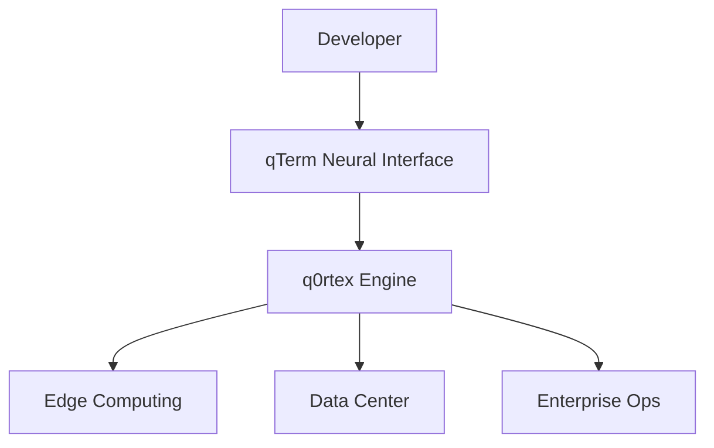

# Quandex: Quantum-Inspired Neural Computing Ecosystem

Quandex revolutionizes enterprise computing by introducing quantum-inspired algorithms and neural interfaces into everyday business operations. Our ecosystem combines advanced mathematical principles from quantum computing with cutting-edge AI to create a new paradigm in human-computer interaction.

## Development Roadmap 🛣️

### Phase 1: Foundation (Q1-Q2 2024)

#### Core Infrastructure 🏗️
- [ ] High-performance compute engine enhancement
- [ ] Metal acceleration framework integration
- [ ] Unified memory architecture optimizations
- [ ] Core API stabilization and qTerm interface

#### Developer Experience 👩‍💻
- [ ] Neural UX with adaptive command interpretation
- [ ] qSyntax: Context-aware quantum processing
- [ ] Thought-to-Code implementation
- [ ] IDE integration and documentation

### Phase 2: Ecosystem Growth (Q2-Q3 2024)

#### Advanced Processing 🚀
- [ ] Enhanced Metal compute pipeline
- [ ] ANE integration for neural processing
- [ ] Quantum-inspired workload optimization
- [ ] Edge-to-cloud neural mesh development

#### Intelligence Framework 🤖
- [ ] Knowledge graph integration
- [ ] Causal inference engine
- [ ] Advanced reasoning capabilities
- [ ] Reality synthesis framework

### Phase 3: Enterprise Features (Q3-Q4 2024)

#### Security & Performance 🔒
- [ ] Enterprise-grade security implementation
- [ ] Access control and audit systems
- [ ] Advanced thermal management
- [ ] Resource optimization and monitoring

## Core Components

### qTerm: Neural Command Interface
- **Neural UX**: Adaptive command interpretation using generative AI
- **qSyntax**: Context-aware quantum-inspired syntax processing
- **Thought-to-Code**: Revolutionary developer experience

### q0rtex: Quantum Neural Engine
- **Quantum-Inspired Processing**: Advanced mathematical models for superior performance
- **Neural Acceleration**: Optimized for modern compute architectures
- **Adaptive Scaling**: Seamless transition from edge to datacenter

### Cortex: Enterprise Neural Operations
- **Business Process Evolution**: AI-driven operational transformation
- **Neural Knowledge Management**: Advanced information processing
- **Quantum-Inspired Decision Making**: Superior pattern recognition

## Enterprise Applications

### Edge Computing
- Distributed neural processing
- Quantum-inspired lambda functions
- Edge-to-cloud neural mesh

### Data Center Evolution
- Neural resource optimization
- Quantum-inspired workload distribution
- Advanced thermal management

## Community Engagement 👥

### Developer Community
- Regular tech talks and workshops
- Open office hours
- Developer documentation portal
- Community showcase events

### Academic Collaboration
- Research partnerships
- Academic paper publications
- Student engagement programs
- Research grants program

## Getting Started

```python
from quandex import QTerminal, NeuralEngine

# Initialize neural terminal
terminal = QTerminal(mode="quantum")

# Execute quantum-inspired operations
async with NeuralEngine() as engine:
    result = await engine.process(
        thought="optimize database queries",
        quantum_level=0.8
    )
```

## Ecosystem Integration



## License

Copyright 2024 Quandex
All rights reserved. Proprietary and confidential.
Not to be distributed without explicit permission.

## Contact

- Enterprise Inquiries: enterprise@quandex.ai
- Developer Relations: devrel@quandex.ai

> Note: All features and timelines are subject to change based on community feedback and technological advances.
